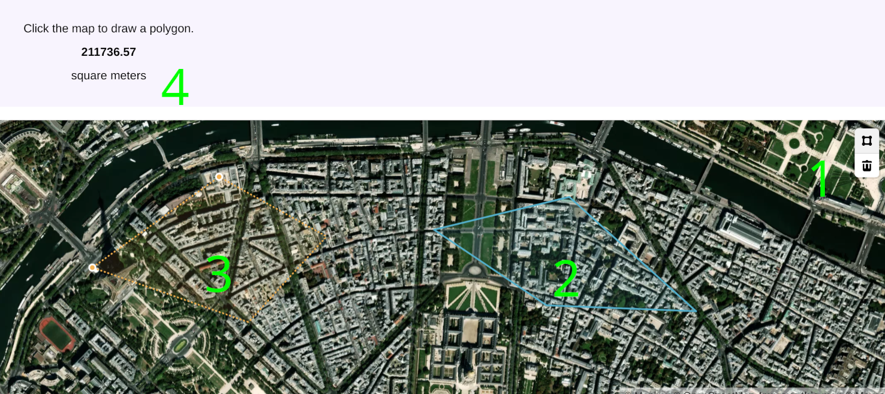

# The *inputs* section
The inputs section describes the characteristics of the input data for the algorithm.

## image

<table>
<caption>Fields for an <em>image</em> as input.</caption>
<thead>
<tr>
<th style="text-align: left;"><span>key</span></th>
<th style="text-align: left;"><span><strong>description</strong></span></th>
<th style="text-align: center;"><span><strong>req</strong></span></th>
</tr>
</thead>
<tbody>
<tr>
<td style="text-align: left;">type</td>
<td style="text-align: left;">type of the input: image</td>
<td style="text-align: center;">yes</td>
</tr>
<tr>
<td style="text-align: left;">description</td>
<td style="text-align: left;">Short name or description. This is used by the web interface.</td>
<td style="text-align: center;">no</td>
</tr>
<tr>
<td style="text-align: left;">max_pixels</td>
<td style="text-align: left;">This value sets the maximum number of pixels allowed for the input. If the size of the image is over this the limit it will be resized. The value can be a number or an arithmetic expression (ex: “1000*1000" = 1 Mpx).</td>
<td style="text-align: center;">yes</td>
</tr>
<tr>
<td style="text-align: left;">max_weight</td>
<td style="text-align: left;">Maximum weight (in bytes) of an input file. This prevents uploading too large files. The value can be a number or an arithmetic expression (ex: “100*1024*1024"= 100 Mb).</td>
<td style="text-align: center;">no</td>
</tr>
<tr>
<td style="text-align: left;">dtype</td>
<td style="text-align: left;"><p>Final format for the image. Some examples:</p>
<ul>
<li><p><em>1x8i</em>: gray, unsigned integer 8 bits;</p></li>
<li><p><em>3x8i</em>: color, RGB unsigned integer 8 bits;</p></li>
<li><p><em>1x16i</em>: gray, unsigned integer 16 bits;</p></li>
<li><p><em>3x16i</em>: color, RGB unsigned integer 16 bits.</p></li>
</ul></td>
<td style="text-align: center;">yes</td>
</tr>
<tr>
<td style="text-align: left;">ext</td>
<td style="text-align: left;">input extension (ie. file format)</td>
<td style="text-align: center;">yes</td>
</tr>
<tr>
<td style="text-align: left;">forbid_preprocess</td>
<td style="text-align: left;">Must be a boolean value. Forbids any pre-processing of the input data. Submitted image is kept as-is. Used by algorithms like noise estimation or modification detection, where re-sampling will affect results. If a processing is needed according to the expected properties, an error message will be displayed to the user. This will also remove the crop feature from the interface.</td>
<td style="text-align: center;">no</td>
</tr>
<tr>
<td style="text-align: left;">control</td>
<td style="text-align: left;">String to include an interactive control. Possible values are "mask", "dots" and "lines" each for a different kind of mask drawing behaviour.</td>
<td style="text-align: center;">no</td>
</tr>
<tr>
<td style="text-align: left;"></td>
<td style="text-align: left;"></td>
<td style="text-align: center;"></td>
</tr>
</tbody>
</table>

## video

| key | **description** | **req** |
|:---|:---|:--:|
| type | type of the input: video | yes |
| description | Short name or description. This is used by the web interface. | no |
| as_frames | Boolean value. The input video will be converted to png images for each frame according to the max_frames field. Frames will be stored in a temporal folder inside the execution directory with the name. (ex: ./input_0/frame_000.png ) | no |
| max_pixels | This value sets the maximum number of pixels allowed for the input video per frame. If the size of the input is over, the video frames will be resized. The value can be a number or an arithmetic expression (ex: “1000\*1000" = 1 Mpx). | yes |
| max_frames | Maximum number of frames after conversion, either as frames or video. | yes |
| max_weight | Maximum weight (in bytes) of an input file. This prevents uploading too large files. The value can be a number or an arithmetic expression (ex: “100\*1024\*1024"= 100 Mb). | no |
| forbid_preprocess | Forbids any pre-processing of the input data by the IPOL system. Submitted video is kept as-is. Used by algorithms like noise-estimation or modification detection, where re-sampling will affect results.If a processing is needed according to the expected properties, an error message will be displayed to the user. | no |

Fields for a *video* as input.

## data

The *data* type is used when the input type is other than an image or a video. Submitted data is kept as it is. The extension of your data file should be defined in the "ext" column.

| key | **description** | **req** |
|:---|:---|:--:|
| type | type of the input: data | yes |
| description | Short name or description. This is used by the web interface. | no |
| max_weight | Maximum weight (in bytes) of an input file. This prevents uploading too large files. The value can be a number or an arithmetic expression (ex: “100\*1024\*1024"= 100 Mb). | no |
| ext | input extension (ie. file format, eg: .txt, .tiff) | yes |

Fields for the *data* as input.

#### Example:

An example of the *data* input for a demo is shown below. An input file with the .txt format is required in this case.

``` json
"inputs": [
    {
    "description": "Text file containing the curve points",
    "max_weight": 524288000,
    "ext": ".txt",
    "required": true,
    "type": "data"
    }
]
```

## map

The *map* type the interface makes the demo show a map of the Earth where the user can drawn one or more polygons interactively. The selection is passed to the demo’s code as a list of GeoJSON features containing geometric coordinates.

<figure id="fig:geojson_example" data-latex-placement="h">

<figcaption>The IPOL’s map interface. 1) The controls to draw and remove polygons, 2) A polygon already draw, 3) A polygon being drawn, and 4) the information about the current polygon.</figcaption>
</figure>

Figure <a href="#fig:geojson_example" data-reference-type="ref" data-reference="fig:geojson_example">1</a> shows the control and its key elements. To draw a polygon there is a toolbox (1) which allows to start drawing a polygon and to remove completely the last one. Click on the upper icon to start drawing and click on the map to add as many vertices as needed. You can also start adding vertices by clicking the right button of the mouse. When done, click the right button of the mouse. After that, the polygon will appear as finished (2). You can drawn more than one polygon, if needed. After finishing with the first, you can draw a second one (3). The information about the current polygon is show above (4).

The map is an interactive 3D projection. You can move around and change the location using the mouse and dragging with the left button, or using the keyboard cursors. With the right button of the mouse you can rotate the map and change the orientation of the camera. The zoom can be adjusted with the wheel of the mouse or with ’+’/’-’ in the keyboard.

The demo will receive a GeoJSON file containing the coordinates as a list of geometric features. For example, a selection made of two polygons of three and four vertices would be encoded as follows:

``` json
{
    "type": "FeatureCollection",
    "features": [
        {
            "id": "1a3e0b6db723596db6da77b80ea0904f",
            "type": "Feature",
            "properties": {},
            "geometry": {
                "coordinates": [
                    [
                        [
                            -3.69022875121982,
                            40.41938883192799
                        ],
                        [
                            -3.6927607565289122,
                            40.41605617841688
                        ],
                        [
                            -3.6802294760118457,
                            40.41563141659978
                        ],
                        [
                            -3.69022875121982,
                            40.41938883192799
                        ]
                    ]
                ],
                "type": "Polygon"
            }
        },
        {
            "id": "ca0e17328f3186e57d84fd8c535f6ab5",
            "type": "Feature",
            "properties": {},
            "geometry": {
                "coordinates": [
                    [
                        [
                            -3.7089827566515794,
                            40.42069570981127
                        ],
                        [
                            -3.695464423216549,
                            40.41857202035922
                        ],
                        [
                            -3.70220213226159,
                            40.4154026975869
                        ],
                        [
                            -3.712544730223499,
                            40.417526487080124
                        ],
                        [
                            -3.7089827566515794,
                            40.42069570981127
                        ]
                    ]
                ],
                "type": "Polygon"
            }
        }
    ]
}
```

Note that a polygon of $`N`$ vertices is encoded as a list of $`N+1`$ coordinates, where the first equals the last. This is the GIS [standard](https://www.ogc.org/standard/sfa/) to represent a topologically closed curve.

Here it follows an example to read the GeoJSON file in Python:

``` python
#!/usr/bin/env python3
# -*- coding: UTF-8 -*-

import json
import argparse

def print_polygons(polygons):
    '''
    Print the information of given polygons
    '''
    if not polygons:
        print("No polygons were drawn in the map")
        return
    
    print(f"{len(polygons)} polygon(s) were drawn in the map:")
    for polygon in polygons:
        print(f"\t- polygon with {len(polygon)} vertices:")
        for coord in polygon:
            print(f"\t\t{coord}")

parser = argparse.ArgumentParser(description='GeoJSON example.')
parser.add_argument('--json', type=str, help='Input filename', default='input_0.json')
args = parser.parse_args()

# Load GeoJSON
with open(args.json, "rt") as f:
    D = json.load(f)

# Store here the list of polygons found in the GeoJSON file
polygons = []

# Parse the GeoJSON
# The coordinates are in feature['geometry']['coordinates']
for feature in D['features']:
    if 'geometry' not in feature:
        continue
    
    if 'coordinates' not in feature['geometry']:
        continue
    
    coordinates = feature['geometry']['coordinates'][0]
    polygons.append(coordinates)

# Finally, print the information of the polygons found
print_polygons(polygons)
```

When a demo uses a map, it can only contain that single input in the DDL.

| key | **description** | **req** |
|:---|:---|:--:|
| type | type of the input: map | yes |
| center | longitude and latitude (example: \[-3.703790, 40.416775\] to center the map in Madrid) | no |
| ext | input extension (for example, .json) | yes |

Fields of *map* input type.
