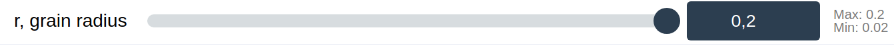
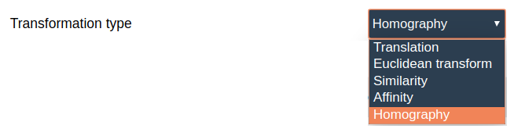
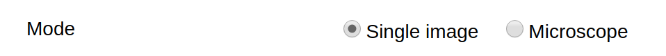
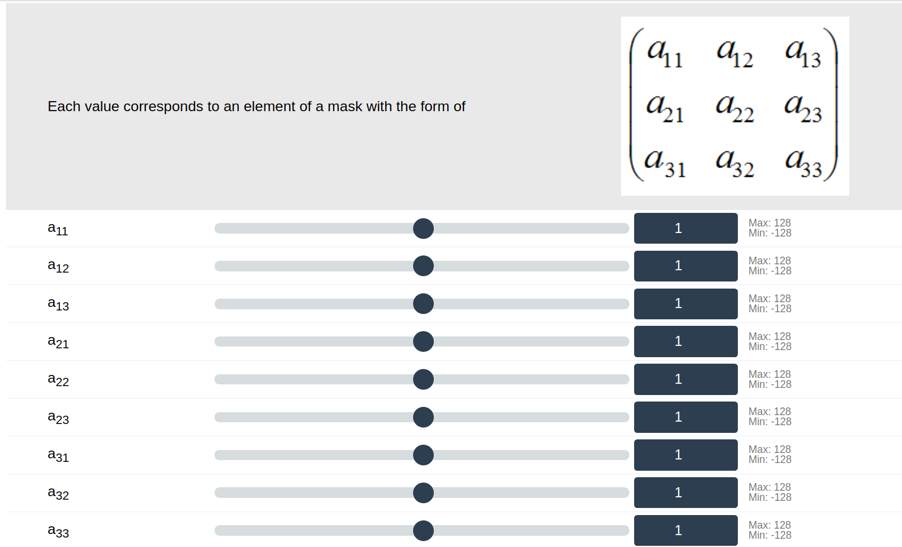
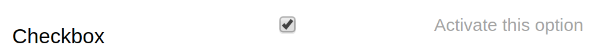
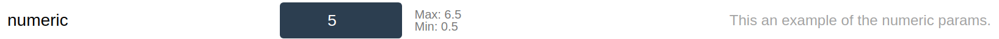
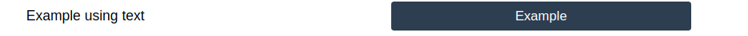
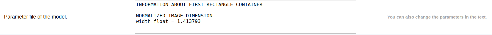

# The *params* section
The *params* section describes the set of parameters needed by a demo, their constraints and the visual appearance of the user control. It is defined as an array of sets, where each set contains (key, value) pairs. In this section, we show examples of the expected appearance of these parameters in the web interface. The look of the controls might differ depending on the operating system and the browser used.

## range

The *range* type is used as an horizontal slider constrained by a minimum and a maximum numeric values. It can be moved with the mouse or by using the arrow keys according to the step value fixed in the DDL. The user control is similar to the one at Figure <a href="#fig:sliders" data-reference-type="ref" data-reference="fig:sliders">2</a>.

| key | **description** | **req** |
|:---|:---|:--:|
| type | range | yes |
| id | Used to identify the parameter. | yes |
| label | A name and/or description of the parameter. It appears on the left side in the web interface. | no |
| comments | A description of the parameter. It appears on the right side in the web interface. | no |
| visible | Javascript expression evaluated as a boolean. | no |
| values | Sets min, max, step and default values using a key/value scheme { "min":val, "max":val, "step":val, "default":val }. Ex: to select a value included in (-1, -0.5, 0, 0.5, 1) write `"values": {"min": -5, "max": 5, "step": 0.5, "default": 0}` | yes |

Fields for the properties of the *range* type.

<figure id="fig:sliders" data-latex-placement="h">

<figcaption>Range type example. It shows a slider with values from 0.02 to 0.2.</figcaption>
</figure>

## selection_collapsed

The *selection_collapsed* type returns one string selected by a key (for example, a color code selected by name). The user control is a dropdown select similar to the one in Figure <a href="#fig:selection_collapsed_example" data-reference-type="ref" data-reference="fig:selection_collapsed_example">3</a>.

| key | **description** | **req** |
|:---|:---|:--:|
| type | selection_collapsed | yes |
| id | Used to identify the parameter. | yes |
| label | A name and/or description of the parameter. It appears on the left side in the web interface. | no |
| comments | A description of the parameter. It appears on the right side in the web interface. | no |
| visible | Javascript expression evaluated as a boolean. | no |
| values | set of (key, value) pairs, where the key is the displayed text and the value is the string returned, for example `"values": {"black": "000000", "white": "FFFFFF"}` | yes |
| default_value | defines the default value for this parameter, should be one the values defined in ’values’. | yes |

Fields for the properties of the *selection_collapsed* type.

<figure id="fig:selection_collapsed_example" data-latex-placement="h">

<figcaption>Selection collapsed example. In this case, the selection offers five options to choose.</figcaption>
</figure>

## selection_radio

The *selection_radio* returns one string selected by a key (for example, a color code selected by name). The user control is a set of radio buttons as in Figure <a href="#fig:selection_radio_example" data-reference-type="ref" data-reference="fig:selection_radio_example">4</a>.

| key | **description** | **req** |
|:---|:---|:--:|
| type | selection_radio | yes |
| id | Used to identify the parameter. | yes |
| label | Name and/or description of the parameter. It appears on the left side in the web interface. | no |
| comments | Description of the parameter. It appears on the right side in the web interface. | no |
| visible | Javascript expression evaluated as a boolean. | no |
| values | set of (key, value) pairs, where the key is the displayed text and the value is the string returned, for example `"values": {"black": "000000", "white": "FFFFFF"}` | yes |
| default_value | defines the default value for this parameter, should be one the values defined in ’values’. | yes |
| vertical | It is boolean value. The button distribution is vertical when the value is activated (true), otherwise, the visualization is horizontal as default. | no |

Fields for the properties of the *selection_radio* type.

<figure id="fig:selection_radio_example" data-latex-placement="h">

<figcaption>Radio buttons example. The label description is Mode and the parameter offers two radio buttons. The vertical option is disabled.</figcaption>
</figure>

## label

The *label* type can be used to separate groups of parameters or to include html fields (images, external links, etc.) in the web interface.

| key | **description** | **req** |
|:---|:---|:--:|
| type | label | yes |
| label | HTML text to display, as a single string or as an array of strings. | yes |
| visible | Javascript expression evaluated as a boolean. | no |

Fields for the properties of the *label* type.

<figure id="fig:label_example" data-latex-placement="h">

<figcaption>Label example. The label explains that the sliders below represent matrix values according to the image depicted in the label.</figcaption>
</figure>

## checkbox

The *checkbox* type returns a boolean value. The user control is a checkbox similar to the one in Figure <a href="#fig:checkbox_example" data-reference-type="ref" data-reference="fig:checkbox_example">6</a>.

| key | **description** | **req** |
|:---|:---|:--:|
| type | checkbox | yes |
| id | Used to identify the parameter. | yes |
| label | A name and/or description of the parameter. It appears on the left side. | no |
| comments | A description of the parameter. It appears on the right side in the web interface. | no |
| visible | Javascript expression evaluated as a boolean. | no |
| default_value | boolean: True for checked |  |

Fields that manages the properties of the *checkbox* type.

<figure id="fig:checkbox_example" data-latex-placement="h">

<figcaption>Checkbox example. This can be used in the demos that need to activate or not an option.</figcaption>
</figure>

## numeric

The *numeric* type returns a numeric value validated against constraints (min, max). The user control is an input field with numbers. Note that this is quite similar to the *range* type but without the slider. You can see an example in Figure <a href="#fig:numeric_example" data-reference-type="ref" data-reference="fig:numeric_example">7</a>.

| key | **description** | **req** |
|:---|:---|:--:|
| type | numeric | yes |
| id | Used to identify the parameter. | yes |
| label | A name and/or description of the parameter. It appears on the left side. | no |
| comments | A description of the parameter. It appears on the right side in the web interface. | no |
| visible | Javascript expression evaluated as a boolean. | no |
| values | Set min, max, and default values using the following key/value scheme `"values": {"min": -5, "max": 5, "default": 0}` | yes |

Fields for the properties of the *numeric* type.

<figure id="fig:numeric_example" data-latex-placement="h!">

<figcaption>Numeric example. The label explains that the sliders below represent matrix values according to the image depicted in the label.</figcaption>
</figure>

## text

The *text* type returns a string. The user control is an input field.

| key | **description** | **req** |
|:---|:---|:--:|
| type | text | yes |
| id | Used to identify the parameter. | yes |
| label | A name and/or description of the parameter. It appears on the left side. | no |
| comments | A description of the parameter. It appears on the right side in the web interface. | no |
| visible | Javascript expression evaluated as a boolean. | no |
| values | set maxlength in characters and default values using the following key/value scheme `"values": {"maxlength": 3, "default": "fr"}` | no |

Fields for the properties of the *text* type.

<figure id="fig:text_example" data-latex-placement="h">

<figcaption>Text example. The user can write some text as parameter for the demo.</figcaption>
</figure>

## textarea

This param allows including textual information as a parameter. The text must be written in the DDL with the correct format. This means that the text area can show your message with new lines, skip lines and the normal ways of a file if the encoding format is correct. For instance, if you want that your text area looks like in Figure <a href="#fig:textarea_example" data-reference-type="ref" data-reference="fig:textarea_example">9</a>, the default value must be as in the following example:

#### Examples:

Example of a DDL when using a text area.

``` json
{
  "default_value": "INFORMATION ABOUT FIRST RECTANGLE CONTAINER\r\nNORMALIZED IMAGE DIMENSION\r\nwidth_float = 1.413793\r\n",
            "wrap":false,
            "height": 5,
            "type": "textarea",
            "id": "file_1",
            "label": "Parameter file of the model.",
            "comments":"<b>You can also change the parameters in the text.<b>",
}
```

| key | **description** | **req** |
|:---|:---|:--:|
| type | textarea | yes |
| label | name and/or description of the parameter. It appears on the left side. | no |
| id | Used to identify the parameter. | yes |
| default_value | Text to include in the text area | no |
| visible | Javascript expression evaluated as a boolean. | no |
| height | Set the height of your textarea. The maximum value is 2000px. | no |
| width | Set the width of your textarea. If you do not include the parameter it will be 100%. | no |
| wrap | This attribute specifies how the text in a text area is wrapped. False means that the line is not adapted to the textarea. True the opposite. | no |

Fields for the properties of the *textarea* type.

<figure id="fig:textarea_example" data-latex-placement="h!">

<figcaption>textarea example. The label explains that the sliders below represent matrix values according to the image depicted in the label.</figcaption>
</figure>
