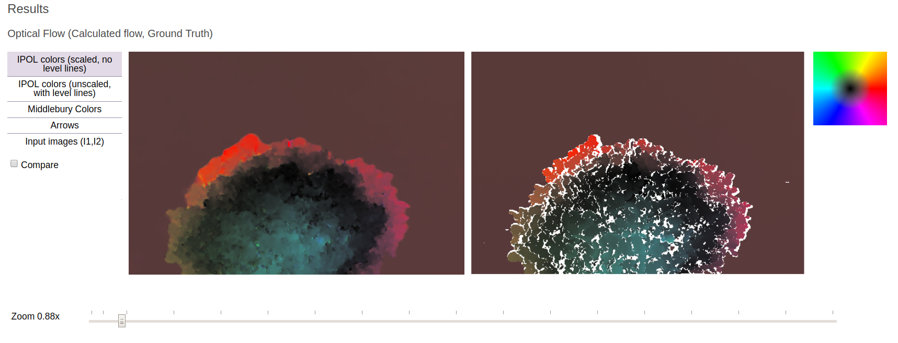

# The *results* section
The results specifies what to display as a result of an experiment. It is an array of sets, where each entry describes one type of output from the algorithm. There are displayed sequentially one below the other.

## gallery

The results *gallery* type displays images. These ones can be displayed in different rows and columns. The example of this section shows the Demo Description Lines required for the visualization showed in the Figure <a href="#fig:image_gallery_example" data-reference-type="ref" data-reference="fig:image_gallery_example">10</a>. Notice that each row implies an array for each image. In the case that you only want to display one image, the DDL only required an expresion like: `"label":{ "img": "name_of_file.extension"}`

<table>
<caption>Properties of the <em>gallery</em> type in the results section.</caption>
<thead>
<tr>
<th style="text-align: left;"><span>key</span></th>
<th style="text-align: left;"><span><strong>description</strong></span></th>
<th style="text-align: center;"><span><strong>req</strong></span></th>
</tr>
</thead>
<tbody>
<tr>
<td style="text-align: left;">type</td>
<td style="text-align: left;">gallery</td>
<td style="text-align: center;">yes</td>
</tr>
<tr>
<td style="text-align: left;">visible</td>
<td style="text-align: left;">A Javascript expression evaluated as a boolean.</td>
<td style="text-align: center;">no</td>
</tr>
<tr>
<td style="text-align: left;">label</td>
<td style="text-align: left;">HTML label for the gallery, can be either a single string or a list of string that will be concatenated.</td>
<td style="text-align: center;">no</td>
</tr>
<tr>
<td style="text-align: left;">contents</td>
<td style="text-align: left;"><p>A set of sets, each entry describes one or more images with a key and properties:</p>
<ul>
<li><p><em>key</em>, required, a label for the entry, could be a string or an evaluated expression in case of repeat;</p></li>
<li><p><em>img</em>, required, a string with a filename or an array of strings with filenames;</p></li>
<li><p><em>visible</em>, optional, a Javascript expression evaluated to a boolean;</p></li>
<li><p><em>repeat</em>, optional, a Javascript expression, will create a loop in the form idx=0..range-1</p></li>
</ul></td>
<td style="text-align: center;">yes</td>
</tr>
<tr>
<td style="text-align: left;"></td>
<td style="text-align: left;"></td>
<td style="text-align: center;"></td>
</tr>
</tbody>
</table>

#### Example:

The next example shows the DDL’s needed for displaying three images per row in an image gallery.

``` json
{
 "contents": {
    "IPOL colors (scaled, no level lines)": {
       "img": ["rof_ipoln.png", "ground_truth_ipoln.png", "color_wheel_ipoln.png"]
    },
    "IPOL colors (unscaled, with level lines)":{
       "img": [ "rof_ipol1.png", "ground_truth_ipol1.png", "color_wheel_ipol1.png"]
    },
    "Middlebury Colors":{
       "img": ["rof_middlebury.png", "ground_truth_middlebury.png", "color_wheel_middlebury.png"]
    },
    "Arrows":{
       "img": ["rof_arrows.png", "ground_truth_arrows.png", "color_wheel_arrows.png"]
    },
    "Input images (I1,I2) ": {
       "img": [ "input_0.png", "input_1.png"]
    },
    "label": "<h3>Optical Flow (Calculated flow, Ground Truth)</h3>", 
    "type": "gallery",
    "visible" : "info.gt"
},
```

<figure id="fig:image_gallery_example" data-latex-placement="h">

<figcaption>Example of an image gallery. In this example, we see three images per row.</figcaption>
</figure>

## gallery_video

The results *gallery_video* type displays video files. This type is quite similar to the previous one but related to the visualization of video contents.

<table>
<caption>Properties of the <em>gallery_video</em> type in the results section.</caption>
<thead>
<tr>
<th style="text-align: left;"><span>key</span></th>
<th style="text-align: left;"><span><strong>description</strong></span></th>
<th style="text-align: center;"><span><strong>req</strong></span></th>
</tr>
</thead>
<tbody>
<tr>
<td style="text-align: left;">type</td>
<td style="text-align: left;">gallery_video</td>
<td style="text-align: center;">yes</td>
</tr>
<tr>
<td style="text-align: left;">visible</td>
<td style="text-align: left;">A Javascript expression evaluated as a boolean.</td>
<td style="text-align: center;">no</td>
</tr>
<tr>
<td style="text-align: left;">label</td>
<td style="text-align: left;">HTML label for the gallery, can be either a single string or a list of string that will be concatenated.</td>
<td style="text-align: center;">no</td>
</tr>
<tr>
<td style="text-align: left;">contents</td>
<td style="text-align: left;"><p>A set of sets, each entry describes one or more images with a key and properties:</p>
<ul>
<li><p><em>key</em>, required, a label for the entry, could be a string or an evaluated expression in case of repeat;</p></li>
<li><p><em>img</em>, required, a string with a filename or an array of strings with filenames;</p></li>
<li><p><em>visible</em>, optional, a Javascript expression evaluated to a boolean;</p></li>
<li><p><em>repeat</em>, optional, a Javascript expression, will create a loop in the form idx=0..range-1</p></li>
</ul></td>
<td style="text-align: center;">yes</td>
</tr>
<tr>
<td style="text-align: left;"></td>
<td style="text-align: left;"></td>
<td style="text-align: center;"></td>
</tr>
</tbody>
</table>

#### Examples:

Advanced example, mixing repeat, visible, using an array of filenames.

``` json
{
    "type": "video_gallery",
    "label": "<b>Video gallery</b>",
    "display": "grid",
    "visible": false,
    "contents": {
        "Input_0": {
            "video":  "'input_0.mp4'",
            "visible": false
        },
        "'Scale_'+idx": {
            "video":  "'scaled_'+idx+'.mp4'",
            "repeat": "4"
        }
    }
}
```

## file_download

The results *file_download* type proposes a link to download a file.

| key | **description** | **req** |
|:---|:---|:--:|
| type | file_download | yes |
| visible | A Javascript expression evaluated as a boolean. | no |
| repeat | range expression (evaluated in Javascript): will create a loop in the form idx=0..range-1 | no |
| label | HTML title associated to the file to download. In case of repeat, evaluated as an expression with idx variable, otherwise, can be evaluated if it starts with a single quote. | yes |
| contents | either a single string of the filename to download, or a list of label:filename pairs for files to download. In case of repeat, evaluated as an expression with idx variable. | yes |

Properties of the *file_download* type in the results section.

We show two examples: the first one is to download one result and the second is to download several results in the same line.

#### Examples

:\

``` json
{ 
    "type"     : "file_download", 
    "label"    : "Download Hough result",
    "contents" : "output_hough.png" 
}
```

``` json
{
    "type"     : "file_download", 
    "label"    : "<h3>Download computed optical flow:</h3>",
    "contents" : {
        "tiff": "stuff_tvl1.tiff", 
        "flo" : "stuff_tvl1.flo",
        "uv"  : "stuff_tvl1.uv"
    }
}
```

Example using *repeat*:

``` json
{ 
    "type"     : "file_download", 
    "repeat"   : "params.scales",
    "label"    : "'Download the estimations obtained at scale '+idx",
    "contents" : "'estimation_s'+idx+'.txt'"
}
```

## html_text

It displays the given HTML-encoded content.

| key | **description** | **req** |
|:---|:---|:--:|
| type | html_text | yes |
| visible | A Javascript expression evaluated as a boolean. | no |
| contents | An array of strings, that will be concatenated to form the HTML content. This content can contain Javascript expression if it starts with a single quote. | yes |

Properties of the *html_text* type in the results section.

#### Example

:\

``` json
{ 
    "type"          : "html_text", 
    "contents"      : [
        "'<p style=\"font-size:85%\">",
        "* &ldquo;Exact&rdquo; is computed with FIR, ",
        "DCT for &sigma;&nbsp;&gt;&nbsp;2 ",
        "(using '+params.sigma<=2?'FIR':'DCT'+",
        "'</p>'" 
    ] 
}
```

## html_file

It displays the given HTML file.

| key      | **description**                                 | **req** |
|:---------|:------------------------------------------------|:-------:|
| type     | html_file                                       |   yes   |
| visible  | A Javascript expression evaluated as a boolean. |   no    |
| contents | A string with a filename.                       |   yes   |

Properties of the *html_file* type in the results section.

#### Example

:\

``` json
{
    "type"          : "html_file",
    "contents"      : "output.html"
}
```

## text_file

It displays the contents of a text file.

| key | **description** | **req** |
|:---|:---|:--:|
| type | text_file | yes |
| visible | Javascript expression evaluated as a boolean. | no |
| label | HTML label. | yes |
| contents | A text filename to display. | yes |
| style | CSS rules written in a JSON string, ex `"style": "{’font-weight’: ’bolder’, ’color’: ’red’}"` | yes |

Properties of the *text_file* type in the results section.

#### Example

:\

``` json
{ 
    "type"          : "text_file", 
    "label"         : "<h2>Output<h2>",
    "contents"      : "stdout.txt",
    "style"         : "{'width': '40em', 'height': '16em', 'background-color': '#FFE'}"
}
```

## message

The *message* type displays a text message with a predefined color. This can be used for warning or error messages.

| key | **description** | **req** |
|:---|:---|:--:|
| type | message | yes |
| visible | Javascript expression evaluated as a boolean. | no |
| contents | A string which will be evaluated by Javascript to get the message. | yes |
| textColor | The name of a color or a CSS-compatible color. | no |

Properties of the *message* type in the results section.

#### Examples

:\

``` json
{    
    "contents": "'Image too small: the input image needs to be at least 42000 pixels to get a reliable estimate<br> Forced to use one bin for the estimation.'", 
    "type": "message", 
    "textColor": "red",
    "visible": "info.sizeX * info.sizeY < 42000" 
}
```

## three_d

The result type *three_d* displays a 3D output such as .obj files in an interactive viewer.

| key      | **description**                               | **req** |
|:---------|:----------------------------------------------|:-------:|
| type     | three_d                                       |   yes   |
| visible  | Javascript expression evaluated as a boolean. |   no    |
| label    | HTML label.                                   |   yes   |
| contents | A 3D filename to display.                     |   yes   |

Properties of the *three_d* type in the results section.

#### Examples

:\

``` json
{    
    "contents": "3Dcomparison.obj", 
    "type": "three_d", 
    "label": "3D output file"
}
```
